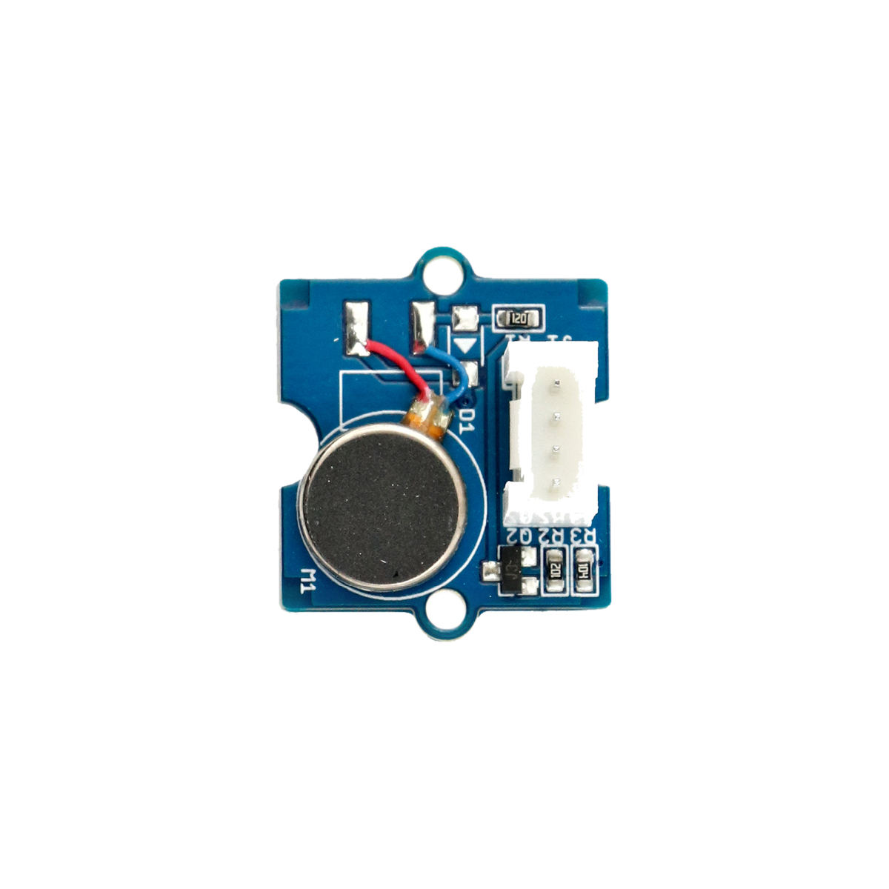

# Vibrationsmotor

## Beschreibung
Der Miniatur-Vibrationsmotor erzeugt trotz des kleinen Bauraums eine relativ starke Vibration. Dadurch kann für diverse Anwendungen beispielsweise ein haptisches Feedback bewirkt werden. Der Motor lässt sich direkt oder mithilfe des Grove Shields an einen Arduino oder Raspberry Pi anschließen. Mit einem einfachen digitalen HIGH-Signalvibriert der Motor dann ähnlich wie ein stumm geschaltetes Smartphone.

Alle weiteren Hintergrundinformationen sowie ein Beispielaufbau und alle notwendigen Programmbibliotheken sind auf dem offiziellen Wiki (bisher nur in englischer Sprache) von Seeed Studio zusammengefasst. Zusätzlich findet man über alle gängigen Suchmaschinen meist nur mit der Eingabe der genauen Komponenten-Bezeichnungen entsprechende Projektbeispiele und Tutorials.

## Beispiele

!!!show-examples:./examples/

<!-- infolist -->

 

## Wichtige Links für die ersten Schritte:

- [Seeed Studio Wiki](http://wiki.seeedstudio.com/Grove-Vibration_Motor/) [- Vibrationsmotor](http://wiki.seeedstudio.com/Grove-Vibration_Motor/)

## Projektbeispiele:

- [Arduino-Tutorial - Direkte Motoransteuerung](https://www.arduino-tutorial.de/motorsteuerung-direkt-per-arduino/)

## Weiterführende Hintergrundinformationen:

- [GPIO - Wikipedia Artikel](https://de.wikipedia.org/wiki/Allzweckeingabe/-ausgabe)
- [GitHub-Repository: Vibrationsmotor](https://github.com/MakeYourSchool/47-Vibrationsmotor)

